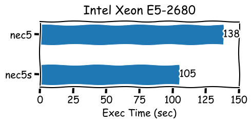
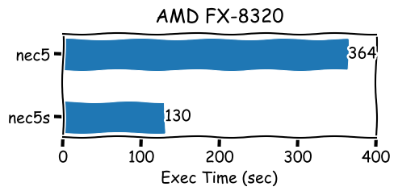
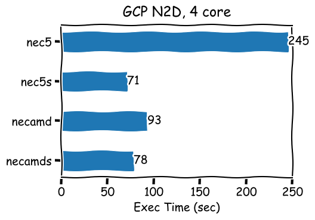
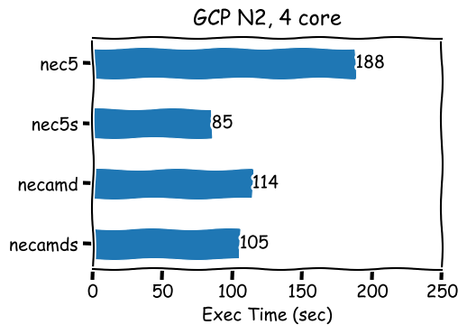

# Some Speed Comparisons 

The file [Compile_NEC5.ipynb](Compile_NEC5.md) contains descriptions of building the NEC5 command-line executable using various compilers and math libraries:

| Executable | Description |
| ----------- | ----------- |
| nec5 | Intel FORTRAN compiler, Intel Math Kernel Library (MKL) (link with shared libraries)|
| nec5s | Intel FORTRAN compiler, Intel Math Kernel Library (MKL)  (link with static libraries)|
| nec5amd | AMD Optimizing Fortran Compiler (AOCC), AMD Optimizing CPU Libraries (AOCL)  (link with shared libraries)|
| nec5amds | AMD Optimizing Fortran Compiler (AOCC), AMD Optimizing CPU Libraries (AOCL)  (link with static libraries)|

The following graphs show the execution times for various executables and hardware types. Specifically, these are the execution times in seconds to run the optimization task in [optimize.py](optimize.py), which entails running 10,100 NEC5 simulation jobs in the course of optimizing a Yagi antenna design using a genetic algorithm provided by the `pymoo` package.

### Intel E5-2680 Xeon workstation, 16 cores

Ten-year-old Intel server platform; AMD executables won't run on older Intel hardware.
Version with static Intel libraries executes in 76% of time needed by dynamic/shared version.

### AMD FX-8320 workstation, 8 cores

Older (pre-Ryzen) AMD hardware; AMD executables won't run on pre-Ryzen AMD workstations either.
Performance of Intel MKL is (I presume) intentionally impaired (but only with dynamic linking?)

### Google Cloud Platform N2D VM (AMD Epyx, 4 cores)

### Google Cloud Platform N2 VM (Intel Xeon, 4 cores)

